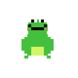
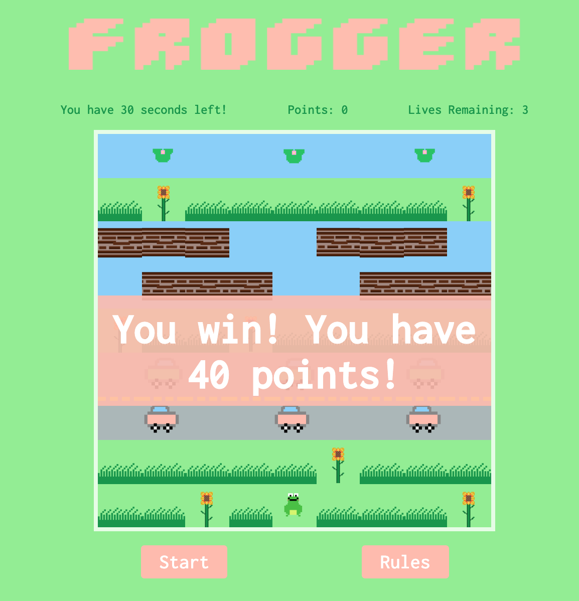

# PROJECT 1 - FROGGER  


## Overview 
Frogger was my first front-end development project undertaken during my time on GA's Software Engineering Immersive course.

Try it out [here](https://kianna.love/frogger/)! 

The game was to be built individually and completed within one week - *Please see below for the project brief.*


## General Project Brief
- Build a game individually.
- Be creative.
- Render a game in the browser.
- Design logic for winning & visually display which player won.
- Include separate HTML / CSS / JavaScript files.
- Stick with **KISS (Keep It Simple Stupid)** and **DRY (Don't Repeat Yourself)** principles.
* Use **Javascript** for **DOM manipulation**.
* **Deploy your game online**, where the rest of the world can access it.
* Use **semantic markup** for HTML and CSS (adhere to best practices).

## Frogger Brief
- The game should be playable for one player.
- The obstacles should be auto generated and animated.
- The aim of the game is to guide a frog across a road, and a river to its home at the top of the screen.
- Must detect any collision (e.g. with cars and river).
- Timers should be present. 


## Technologies Used
- HTML5
- CSS3
- JavaScript (ES6)
- Git and GitHub
- Google Fonts
- Piskel 

## Approach 
I planned out the build in sections, and used these sections to split my week into achievable deadlines.
My first goal was to create an MVP - a basic version of my game which worked. I devoted 2 days to this.
After this, I spent a further 2 days fixing bugs, creating additional features and styling my game (including creating my pixel pieces).
The final day was focused on finishing styling and refactoring some of my code.

### Days 1 & 2

#### The Grid
I began by creating and placing all of the components needed to play the game. 

- I created the tiles on the grid using a for loop instead of hard-coding each individual tile in my HTML file:

```
for (let i = 0; i < width ** 2; i++) {
    const tile = document.createElement('div')
    tile.classList.add('tile')
    grid.appendChild(tile)
    tiles.push(tile)
    if (i >= 54 && i <= 62) {
      tile.classList.add('roadStripe')
    }
  }
```


- I utilised the forEach() array method to place all of my components on to the grid. Example:

```
 carsRightDisplay.forEach(car => {
    tiles[car].classList.add('carsRight')
  })
```

#### Rendering the Game
The next step was to render my game. In order to do this I created a render game function:

```
function renderGame() {
    tiles.forEach(tile => {
      tile.classList.remove('frog')
      tile.classList.remove('log')
    })
    tiles[frogPosition].classList.add('frog')
    logsLeftDisplay.forEach((logPosition) => {
      tiles[logPosition].classList.add('log')
    })
    logsRightDisplay.forEach((logPosition) => {
      tiles[logPosition].classList.add('log')
    })
  }
```
**Please note this is a shorterned version of the function the appears in my code.**

- I chose to create a render game function, as it saved me from hard coding my elements positions every time they needed to move. This also allowed me to refactor sections of my code further down the line.
- It includes all of the DOM elements - elements manipulated by the DOM used in my game. 
- It works by first stripping the board of all the elements before placing them back according to the logic I have written.

#### Moving Parts

##### User generated
- The frog 

The frog can only be moved once the player has clicked start. To prevent movement before the start button has been clicked I created a boolean variable called endGame and set it to be true:
`let endGame = true`

Inside of the frog's event listener I have stated that **if endGame is true, return** - which means the user cannot move the frog.
However there is an else statement which becomes accessible once **endGame equals false** which contains all of the conditional logic for moving the frog across the grid.

```
 document.addEventListener('keydown', (e) => {
    if (endGame) {
      //game is over but listening
      return
    } else {
      if (e.key === 'ArrowRight') {
        if (frogPosition === tiles.length - 1) {
          return
        }
        frogPosition += 1
      } else if (e.key === 'ArrowLeft') {
        if (frogPosition === 0) {
          return
        }
        frogPosition -= 1
      } else if (e.key === 'ArrowUp') {
        if (frogPosition < width) {
          return
        }
        frogPosition -= width
        console.log('frog has moved')
      } else if (e.key === 'ArrowDown') {
        if (frogPosition > (tiles.length - width - 1)) {
          return
        }
        frogPosition += width
      }
      renderGame()
      gamePoints()
      gameOver()
    }
  })
```
    
Once the start button is clicked, endGame is set to equal false which allows the player to move the frog :

```
 startButton.addEventListener('click', () => {

   
   endGame = false
```

The frog is moved by the user using the arrow keys - included in the else statement keydown event listener. This event listener also considers the game over logic, game points and render game function with each click.

##### Automated 
- The cars
- The logs 
- The lilypads 

These are all automated with functions using **set intervals** to create movement. Example:

```
function moveLilyPads() {
    lilyPadInterval = setInterval(() => {
      lilyPadFinish.forEach((lilypad, i) => {
        if (lilypad === 8) {
          lilyPadFinish[i] = 0

        } else {
          lilyPadFinish[i] += 1
        }
      })
      renderGame()
    }, 500)

  }
```

These functions are defined outside of the start button click event listener but called within it, so that they only start to move once the game has begun.

#### Collision Detection

The frog will lose a life/die if: 

- If it is hit by a car.
- If it touches any of the water in either section.
- If it stays on a log too long and hits either edge of the grid.

When the frog dies you want it to be removed from its current position and re-positioned at the start of the game. In order to do this I created a function called `resetFrog()`.

```
 function resetFrog() {
    frogPosition = 76
    lives = lives - 1
    console.log(lives)
    livesDisplay.innerHTML = `Lives Remaining: ${lives}`
    if (lives !== 0) {
      gameMessage(`${lives} lives left!`, 1000)
    }
    if (lives === 0) {
      resetGame()
    }
  }
```
This function deducts a life every time the frog dies, updates and alerts how many lives you have left and takes into consideration what happens when lives = 0.

#### Winning and Losing

I created a ``gameOver()`` function which is for both when you lose a life and when you win the game.
I also created a ``resetGame()`` function for when the game has officially ended (i.e time is up, you have no lives remaining or you have won). 
This function **resets** all of the pieces/functionality of the game:
- The timer
- The counters (lives and points)
- The movement (clears intervals and removes event listeners)
- Calls the renderGame() function
- Repositions the frog back on the starting tile (76)

To create both I had to consider the **conditions** that needed to be met in order for the game to be reset, over or for the player to have won the game. 

##### Win

- If the player successfully navigates the frog on to one of the lilypads: 
```
 if (tiles[frogPosition].classList.contains('lilypad')) 
```

##### Lose a life

- If the frog collides with one of the obstacles:

```
if (tiles[frogPosition].classList.contains('road') &&  tiles[frogPosition].classList.contains('carsLeft')
      || tiles[frogPosition].classList.contains('carsRight')) {
      resetFrog()
    }
if (tiles[frogPosition].classList.contains('water') && !  tiles[frogPosition].classList.contains('lilypad') && !tiles[frogPosition].classList.contains('log')) {
      resetFrog()
     }

```

##### Lose

- If time is up, or there are no lives remaining:

```
function resetGame() {
    if (!lives || !count) {
```


It is also called within the win game conditional statement inside of the gameOver() function.


### Days 3 & 4

Days 3 and 4 were reserved for bug fixing (*see bugs and challenges section*), adding any addtional features, styling my game with CSS and animating/ creating my game pieces. 


#### Points System
I created the points system and the sunflowers feature on day 4:


The player can gain (and lose) points throughout the game.
Points are gained by collecting the sunflowers that are scattered throughout the tiles. The player will lose points each time the frog loses a life. The deductions vary depending on what has caused the frog to lose a life. The conditions are stated in the rules of the game and are written in the ``gamePoints()`` function using conditional statements:
 
```
 function gamePoints() {
    if (tiles[frogPosition].classList.contains('sunflower')) {
      points += 10
      tiles[frogPosition].classList.remove('sunflower')
      tiles[frogPosition].classList.add('grass')
    }
    if (tiles[frogPosition].classList.contains('water') && !tiles[frogPosition].classList.contains('lilypad') && !tiles[frogPosition].classList.contains('log')) {
      points -= 2
    }
    if (tiles[frogPosition].classList.contains('carsRight') || tiles[frogPosition].classList.contains('carsLeft')) {
      points -= 5
    }
    if (points < 0) {
      points = 0
    }
    pointsDisplay.innerHTML = `Points: ${points}`
  }
```
I also had some fun with my CSS styling and created a popup modal containg the rules for the game, as well as pop up messages that let you know how many lives you have left, or whether you have won or lost the game.

```
  function gameMessage(message, delay) {
    gameOutcome.style.display = 'block'
    gameOutcome.innerHTML = message
    setTimeout(() => {
      gameOutcome.style.display = 'none'
    }, delay)
  }
```



As a bonus feature I added a sound effect for when the player wins the game. I used a setTimeout() function so that the sound plays just a little longer than the winning pop up message is displayed :

```
if (tiles[frogPosition].classList.contains('lilypad')) {
      //message shows for 3 seconds
      gameMessage(`You win! You have ${points} points!`, 3000)
      const audio = document.querySelector('audio')
      audio.play()
      setTimeout(() => {
        audio.pause()
        audio.currentTime = 0
      }, 4000)
      //stops sound after 4 seconds
      resetGame()
    }
```


#### Last day
Some minor code refactoring and I added some new code so that the sunflowers change position with each new game and added some additional styling of a divider to the road.


## Challenges
- CSS specificity! I had an issue getting the frog to appear on top of the log if the log also had a background image. This was eventually fixed by being incredibly specific with CSS classes:

```
div.tile.frog.log.water {
  background-image: url('../images/froggie.png'), url('../   images/logs.png');
  background-size: contain;
}
```


- Frog life logic - some small bugs fixed while building the game. For example, the frog was only dying if you moved the frog in to a car - I had to adjust the logic so that it also died if it was positioned on a road tile and a car moved into it. 
I also had to adjust my if statements so that the frog only lost points/died if it hit a square of water with nothing else on it. 
- It was also tricky writing the logic for the frog dying if it stayed on the log for too long and and went off the edge of game. This logic is included in the ``moveLogsLeft()`` and ``moveLogsRight()` functions and contains specific conditional statements to do with the tile number and what is currently positioned on that tile.
- Automated movement using set intervals. Also see code snippet above. Originally had all of the positions hard coded before adding those code snippets in to the render game function instead.


## Victories
- Managed to fix a lot of the little bugs mentioned above, managed my time well so I had time to add it the additonal sunflower points feature, created a working game!

## Bugs
- If the start button is clicked more than once, all of the automated movement speeds up. 
- If used on other browsers some of the css styling doesn't show up.
- When sunflowers are placed randomly at the beginning of each game, they are sometimes placed under frog/ grass so they can't be seen.
- Not a bug, but on a MacBook Pro, you need to zoom out slightly (at about 75%) to see the full title as well as game board.


## Lessons Learned
- I didn't design this game mobile first, so it is not responsive. For future projects I will begin by designing/building mobile first.


## Future Features
Below is a list of features/ improvements I would like to add to this game:

- High Score Board using local storage.
- Bonus points flower that appears randomly throughout the 30 seconds the game runs on the patches of grass where there are no sunflowers present - on a timer itself so it only appears on the square for a couple of seconds before disappearing and reappearing elsewhere.
- More rows of traffic and river - would like to have included alligators which the frog can still hop on to, but if it ends up on the jaws it loses a life.
- Multiple frogs/ difficulty levels. Frogs equal to the amount of lily pads.
- Make it so the frog cannot go backwards (if you miss a sunflower etc).

## Artwork
All of the artwork and animation included in the game were/was created/drawn by me using Piskel.

Credit to https://fontmeme.com/ for the pixel style font used for the main title and rules section heading.

Credit to https://www.zapsplat.com/ for the frog audio file.


